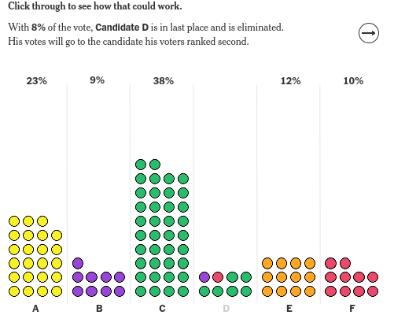

Ranked Choice Vote
==================

>
> "The ballot is stronger than the bullet" - Abraham Lincoln
>
<p float="left">
   
  
</p>

The recent June 2021 NYC mayorial race piqued my interest on ranked choice voting as did reading this [interactive piece](https://www.nytimes.com/interactive/2021/nyregion/ranked-choice-voting-nyc.html) 
and this [writeup](https://www1.nyc.gov/site/civicengagement/voting/ranked-choice-voting.page)

So, (as any normal person) I decided to write a Haskell program to help build a little intuition.

Given say 5+ candidates, voters have the ability to rank their top 5 candidates in ORDER of preference.
If say, only the top three are specified or top two that is COOL too.  When votes are tabulated, the lowest 
ranking candidate for each round is eliminated and their votes can actually MOVE to a different candidate.

Let's say that after the first round, Candidate D ranks the lowest.  For everyone that voted
for Candidate D here, these ballots are given to whoever those folks selected for round 2, like Candidate B 
or even Candidate C.  Just as long as that new candidate is still active and hasn't been eliminated yet. 
Then the ballot ACTUALLY changes hands and gets counted for the new candidate.

This proceeds until there are two candidates left, with the highest tallying candidate winning (even if still under 50% of the vote). 
HOWEVER, if there is a clear outright vote leader in the first round with over 50% of the votes,
they become ~ WINNER ~ aborting any further round tallying.
 
Vote simulates this process by randomly generating vote ballots and ultimately determining the winner.


```ocaml
> ghc Vote.hs
> ./Vote (optional # of ballots, default is 11)

~Ballot Votes:
Ballot {uid: 1, votes: [(1,A),(2,E),(3,C),(4,B),(5,D)], candidate history: [A]}
Ballot {uid: 2, votes: [(1,B),(2,C),(3,E),(4,D),(5,A)], candidate history: [B]}
Ballot {uid: 3, votes: [(1,E),(2,A),(3,C),(4,D)], candidate history: [E]}
Ballot {uid: 4, votes: [(1,D),(2,B),(3,A),(4,E),(5,C)], candidate history: [D]}
Ballot {uid: 5, votes: [(1,B),(2,C),(3,E),(4,A)], candidate history: [B]}
Ballot {uid: 6, votes: [(1,A),(2,D),(3,B),(4,C),(5,E)], candidate history: [A]}
Ballot {uid: 7, votes: [(1,B),(2,E),(3,C),(4,D),(5,A)], candidate history: [B]}
Ballot {uid: 8, votes: [(1,A),(2,E),(3,B),(4,D)], candidate history: [A]}
Ballot {uid: 9, votes: [(1,E),(2,A),(3,B),(4,C)], candidate history: [E]}
Ballot {uid: 10, votes: [(1,D),(2,B),(3,C),(4,E),(5,A)], candidate history: [D]}
Ballot {uid: 11, votes: [(1,C),(2,D),(3,B),(4,A),(5,E)], candidate history: [C]}

```

<p float="left">
  
  
</p>

```ocaml

[B] WINNER!!! Candidate B has the most votes!
~Percentage -> 45.455 percent votes!
~Counts -> [(B,5),(D,4)] out of 11 total
~Note: (After all rounds counted, candidate with most votes wins EVEN if less than 50 percent)
~Winning Ballots: 
  Ballot {uid: 1, votes: [(1,A),(2,E),(3,C),(4,B),(5,D)], candidate history: [A -> 3: From A to Pick 4=B]}
  Ballot {uid: 9, votes: [(1,E),(2,A),(3,B),(4,C)], candidate history: [E -> 2: From E to Pick 3=B]}
  Ballot {uid: 7, votes: [(1,B),(2,E),(3,C),(4,D),(5,A)], candidate history: [B]}
  Ballot {uid: 5, votes: [(1,B),(2,C),(3,E),(4,A)], candidate history: [B]}
  Ballot {uid: 2, votes: [(1,B),(2,C),(3,E),(4,D),(5,A)], candidate history: [B]}
~Discarded Ballots: 
  Ballot {uid: 6, votes: [(1,A),(2,D),(3,B),(4,C),(5,E)], candidate history: [A -> 3: From A to Discard, Pick 4=C Not Active]}
  Ballot {uid: 3, votes: [(1,E),(2,A),(3,C),(4,D)], candidate history: [E -> 2: From E to Discard, Pick 3=C Not Active]}
```
